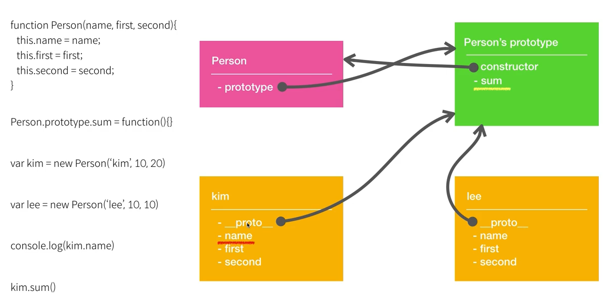

---

typora-root-url: ./prototype-vs-__proto__.png
---

# js-object_oriented_programming

- Object : 서로 연관된 변수와 함수를 그룹핑하고 이름을 붙인것.


### Prototype 사용 이유

1. 공통적으로 기능이나 속성을 정의할수 있다. 
2. 객체 생성시 prototype으로 정의된 메소드는 한번 생성되기때문에 메모리를 절약할 수 있다. 

```javascript

function Person(name, first, second) {
  this.name = name;
  this.first = first;
  this.second = second;
}

// Person이 공통적으로 사용하는 기능이나 속성을 정의할려면 어떻게 해야하나.
// 이렇경우 prototype을 이용한다.
// 이렇게 사용 할 경우 sum을 한번 생성하기 때문에 메모리도 절약할 수 있다.
Person.prototype.sum = function() {
  return "Modifyed : " + this.first + this.second;
};

var lee = new Person("lee", 10, 30);
var kim = new Person("kim", 40, 20);
kim.sum = function() {
  return "this : " + this.first + this.second;
};

console.log(lee.sum());
console.log(kim.sum());
```


### prototype link를 이용한 상속

- \_\_proto\_\_ 는 표준방식이 아니다.
- 값을 찾는 방식이 subObj에서 superVal을 찾는다. 
- 없으면 subObj.\_\_proto\_\_ 에서 superVal을 찾는다.
- 또 없으면 subObj.\_\_proto\_\_.\_\_proto\_\_에서 superVal를 찾는다.

```javascript
var superObj = { superVal: "super" };
var subObj = { subVal: "sub" };

subObj.__proto__ = superObj; // prototype link를 통해서 superObj에있는 suerVal를 찾는다.
console.log("subObj.subVal", subObj.subVal); // sub
console.log("subObj.superVal", subObj.superVal); // super

subObj.superVal = "super modify";
// subObj.superVal을 변경한 것이기 때문에 prototype link를 이용해서 사용한 superObj.superVal의 값은 변경되지 않는다.
console.log("superObj.superVal", superObj.superVal); // super
console.log("subObj.superVal", subObj.superVal); // super modify
```


### Object.create()를 이용한 상속

```javascript
// superObj를 부로로 하는 새로운 객체 subObj2를 만든다.
var subObj2 = Object.create(superObj);
subObj2.subVal = "sub";
console.log("subObj2.subVal", subObj2.subVal);
console.log("subObj2.superVal", subObj2.superVal);
```


### call, bind

```javascript
var kim = {
  name: "kim",
  first: 10,
  second: 20
};

var lee = {
  name: "lee",
  first: 30,
  second: 40
};

function sum(prefix) {
  // this = kim
  return prefix + (this.first + this.second);
}
// call는 넘어오는 객체로 this를 변경한다.
console.log("sum.call(kim) : ", sum.call(kim, "==>")); // apply <- 동일한 일을 함.
console.log("sum.call(lee) : ", sum.call(lee, " : "));

// bind는 새로운 함수를 리턴 해준다.
var kimSum = sum.bind(kim, "-->");

```


### prototype vs \_\_proto\_\_

```javascript
// 둘다 동일한 것이다. 즉 함수는 객체다. 객체이기때문에 프로퍼티를 가질수 있다.
function Person() {}
var Person = new Function(); 

```

Person 객체가 생성되면 Persons' prototype 객체가 또 생긴다. 그래서 prototype프로퍼티로 Person;s prototype객체를 가르키고 있다. (두개는 상호 참조한다.)

\_\_proto\_\_ 는  Person을 이용해서 생성된 object의 prototype을 참조하는 프로퍼티이다. 



